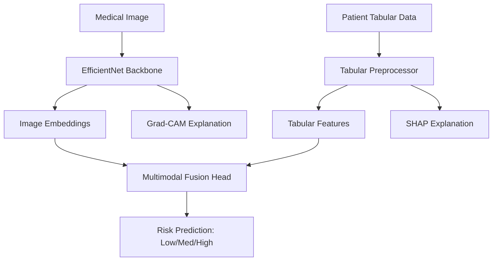

# X-Cancer AI — Explainable Multimodal Cancer Risk Prediction System 🧬🔬

[](https://www.python.org/)
[](https://pytorch.org/)
[](https://fastapi.tiangolo.com/)
[](https://reactjs.org/)

X-Cancer AI is a production-grade, end-to-end AI system designed to assist medical researchers in predicting cancer risk through a multimodal approach. By combining medical imagery (CT scans, Histopathology) with patient clinical data, the system achieves higher diagnostic accuracy and provides unparalleled transparency through integrated explainability modules.

## ✨ Key Features
- **Multimodal Fusion**: Leverages deep learning (EfficientNet) for vision and Gradient Boosting (XGBoost) for tabular data.
- **Explainability (XAI)**: 
  - **Grad-CAM**: Visual heatmaps highlighting regions of interest in medical images.
  - **SHAP**: Quantifiable feature importance for clinical tabular data.
- **Microservices Architecture**: Modular backend powered by FastAPI and a modern React.js frontend.
- **Dockerized**: Fully containerized for seamless reproduction and deployment.

## 🏗️ System Architecture


## 🚀 Getting Started

### 1. Prerequisite
- Python 3.10+
- Node.js & npm
- Docker (optional)

### 2. Manual Setup
```bash
# Clone & Setup Virtual Environment
git clone https://github.com/Vaibhav062006/X-Cancer-AI.git
cd X-Cancer-AI
python -m venv venv
source venv/bin/activate  # venv\Scripts\activate on Windows

# Install Backend Dependencies
pip install -r requirements.txt

# Start Backend
python -m uvicorn backend.main:app --reload

# Setup Frontend
cd frontend
npm install
npm run dev
```

### 3. Docker Deployment
```bash
docker-compose up --build
```

## 📊 Modules
- `models/`: Neural network and ML model definitions.
- `explainability/`: Logic for Grad-CAM and SHAP analysis.
- `backend/`: FastAPI routes and prediction services.
- `frontend/`: React components and UI logic.

---
### ⚠️ Medical Disclaimer
**This software is for research and educational purposes only.** It is not intended for clinical use or to provide professional medical advice. The predictions generated by the system should always be validated by certified medical professionals.

---
**Author**: [Vaibhav Yadav](mailto:yadavvaibhav062006@gmail.com)
**WhatsApp**: +91 8853187957
